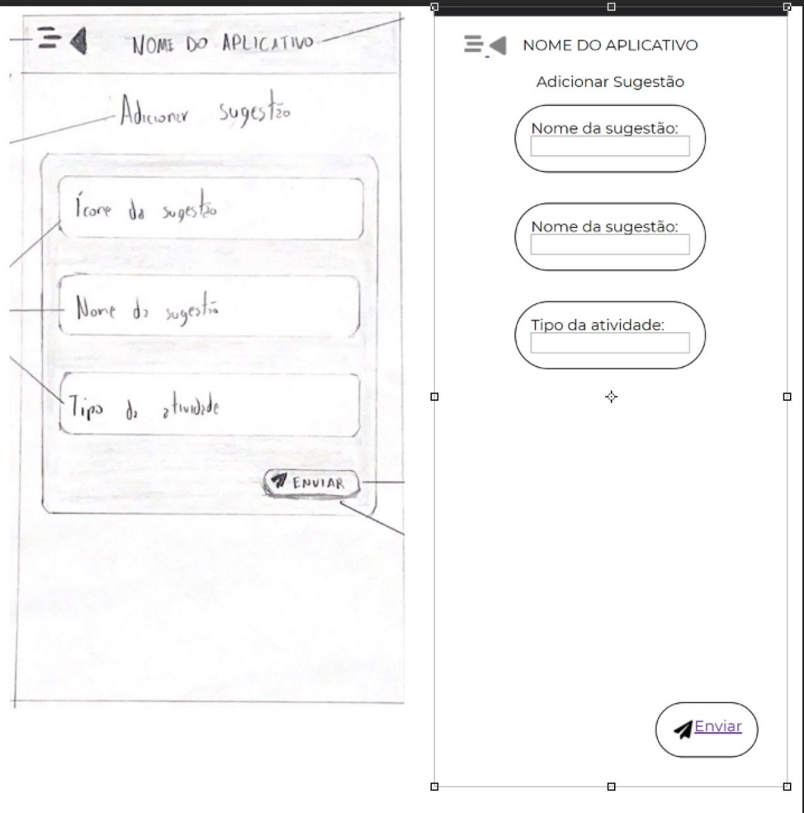
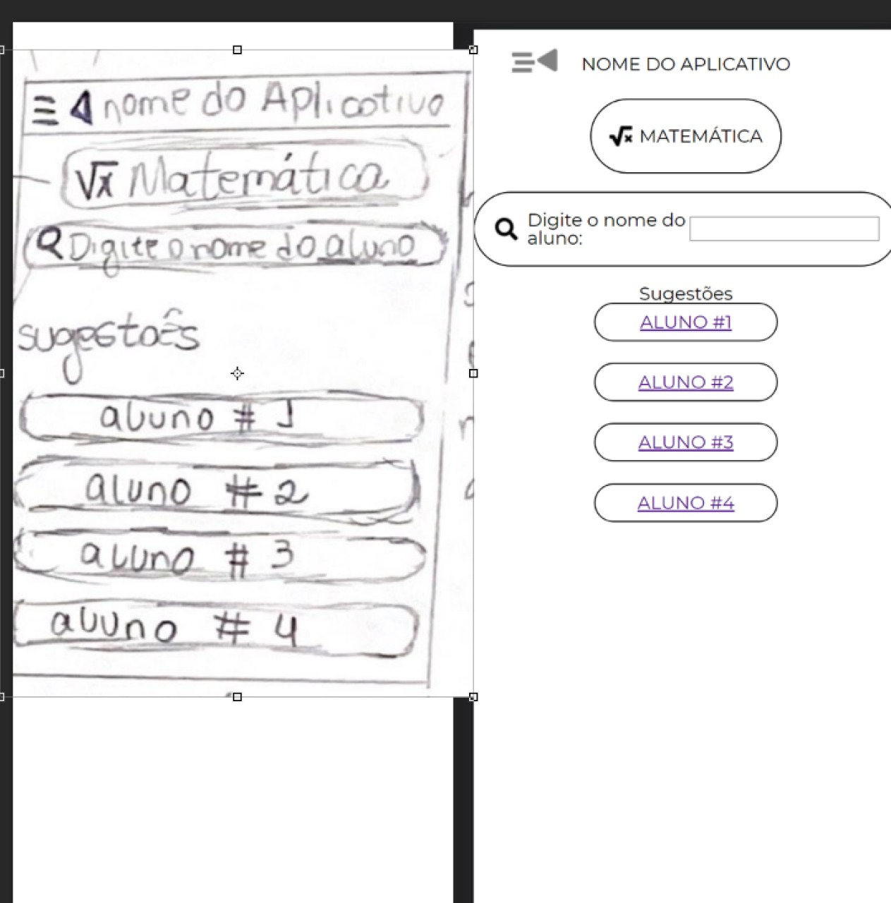
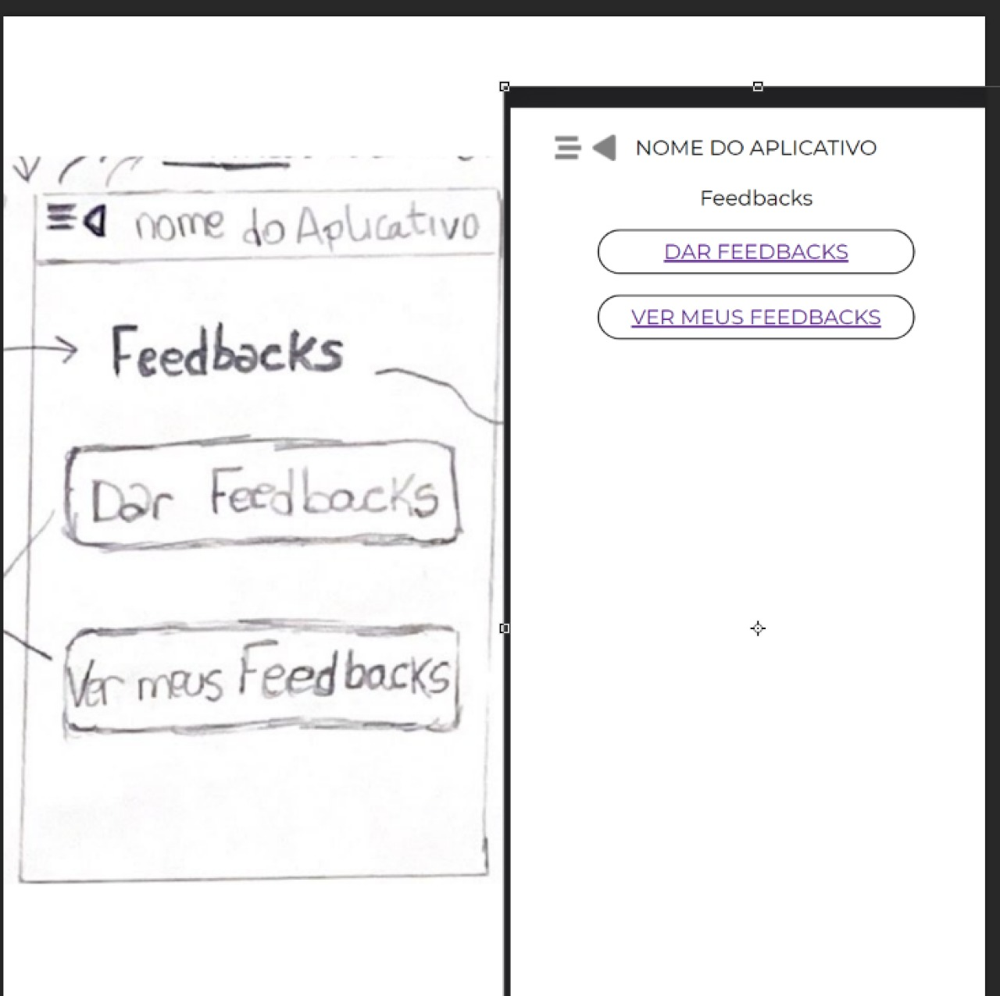
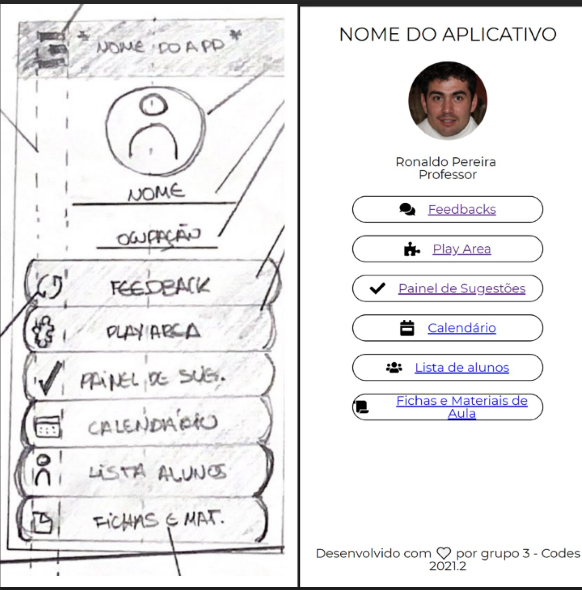
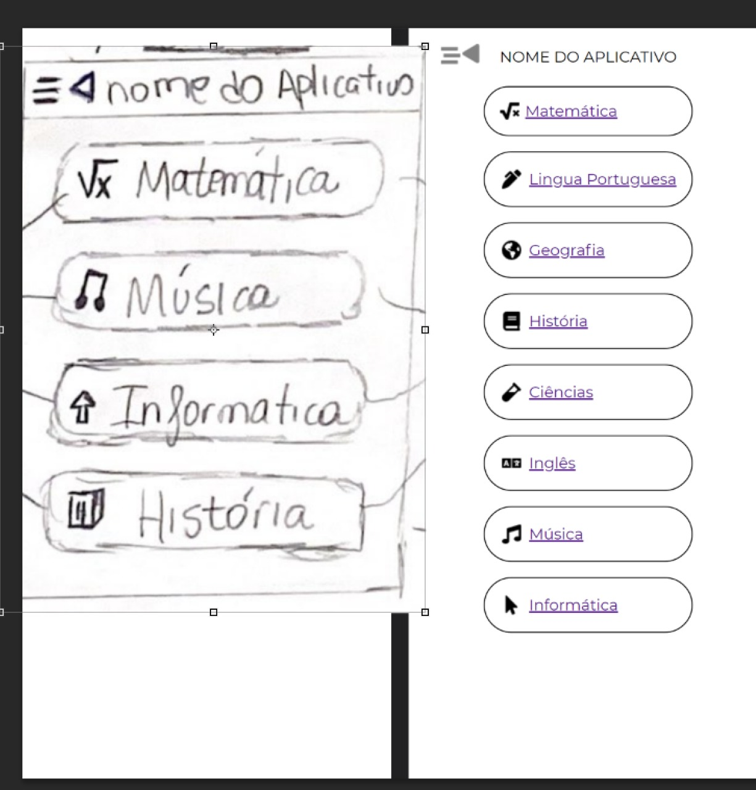
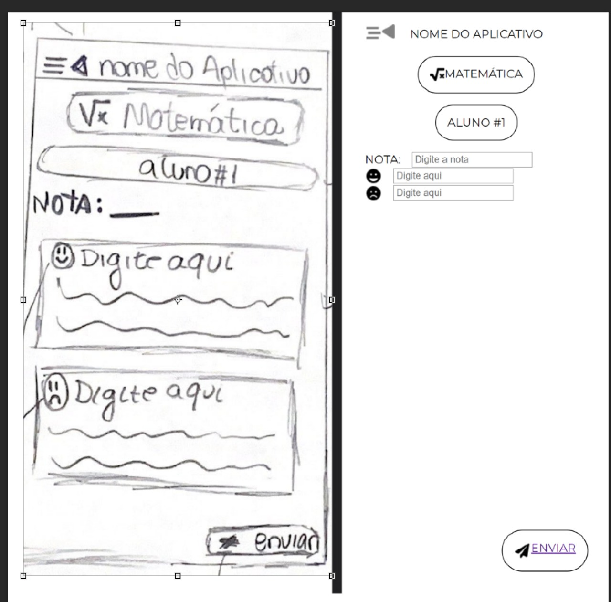
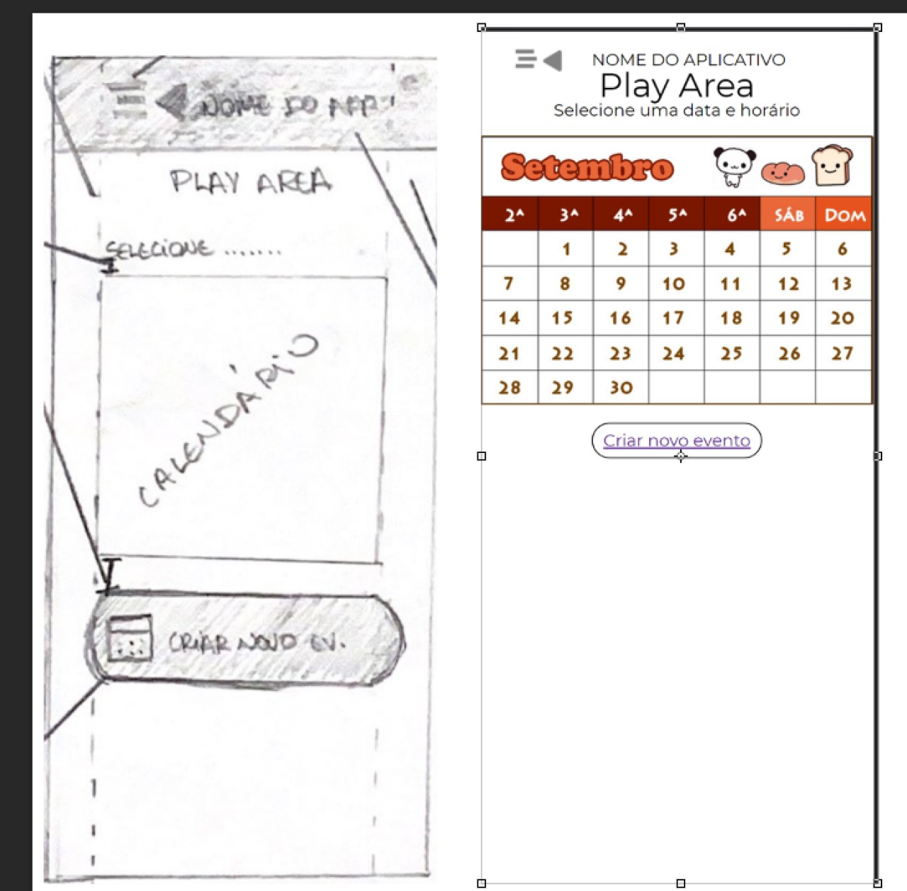
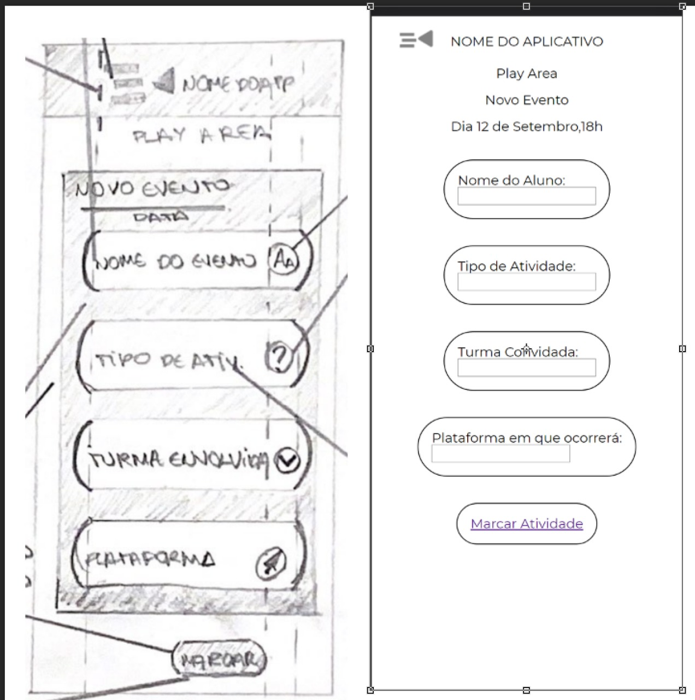
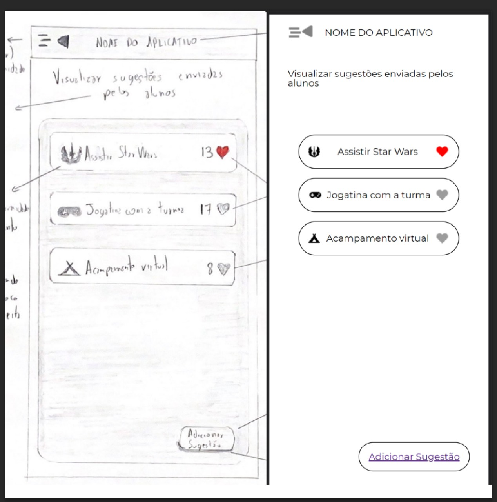

# Justificativas de mudanças no HTML e CSS em relação aos desenhos originais

1. **Em relação ao HTML**

    Foram implementadas mudanças no código HTML que, na visão da equipe, melhorariam o projeto e tornariam futuras implementações mais fáceis. Tais mudanças foram visadas principalmente após a abordagem de determinados conteúdos em sala de aula.

1. **Mudanças em tags HTML:** algumas TAGS HTML foram alteradas para trazer mais semântica ao código HTML, facilitando a interpretação do código por navegadores e também futuras manutenções;
2. **Mudança na ordem de tags no HTML:** Após adquirir conhecimentos sobre posicionamento, principalmente com o uso de flexbox, a equipe julgou que seria adequado algumas mudanças no HTML para facilitar o posicionamento dos elementos na tela utilizando por, exemplo, `flex-direction: column`. 
3. **Adição de novas Tags HTML**: Para também manter a semântica no código novas tags HTML foram adicionadas, por exemplo a tag `<nav>`.
4. **Adição de classes às tags HTML:** Com o objetivo de aplicar estilos utilizando código CSS foram adicionadas classes às tags HTML para uso de seletores no CSS. 

1. **Mudanças em relação aos sketches originais**
- Para determinados conjuntos de elementos, como botões em um menu, no desenho original havia uma cor de background diferente para tal, que deveria ser representada com bordas na entrega atual. Porém, a equipe decidiu retirar essa cor de desataque para trazer mais uniformidade nas telas, e substituir por elementos mais simples, como sombras.
- Sobre o menu "sanduíche" que deveria ser mostrado no mobile, o mesmo não foi implementado pois seria necessário mostrar, ou ocultar, através de um clique em um botão. Para realizar tal ação, de acordos com algumas pesquisas realizadas pela equipe, seria necessário a implementação de uma função JavaScript para adicionar ou remover uma propriedade CSS, neste caso `display: none` utilizando algo do tipo `document.getElementById("id")`para selecionar o elemento e alterar as propriedades CSS que são aplicadas à ele.
- Inputs foram colocados em locais onde espera-se uma ação do usuário, ao invés de usar placeholders já colocamos os inputs para trazer um código HTML mais semântico.

---
##### Comparação do sketch com o que foi implementado no HTML e CSS

A equipe tentou colocar imagens de comparações com os sketchs iniciais e o que foi implementado utilizando HTML e CSS.

